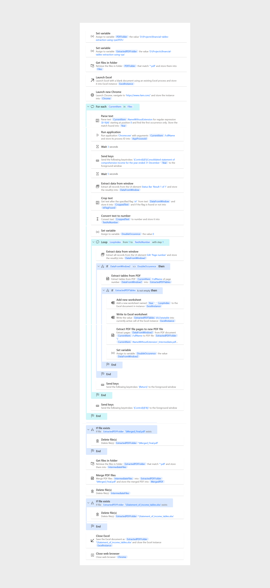

# financial-tables-extraction-using-rpa  
## Power Automate Desktop
### Overview
The goal of this project was to extract the income tables from all the Financial statement PDFs (200+ pages for each) of the Royal London Group present in a designated folder. These tables were written in separate worksheets of an Excel file and then finally merged into a single PDF using Power Automate Desktop.

